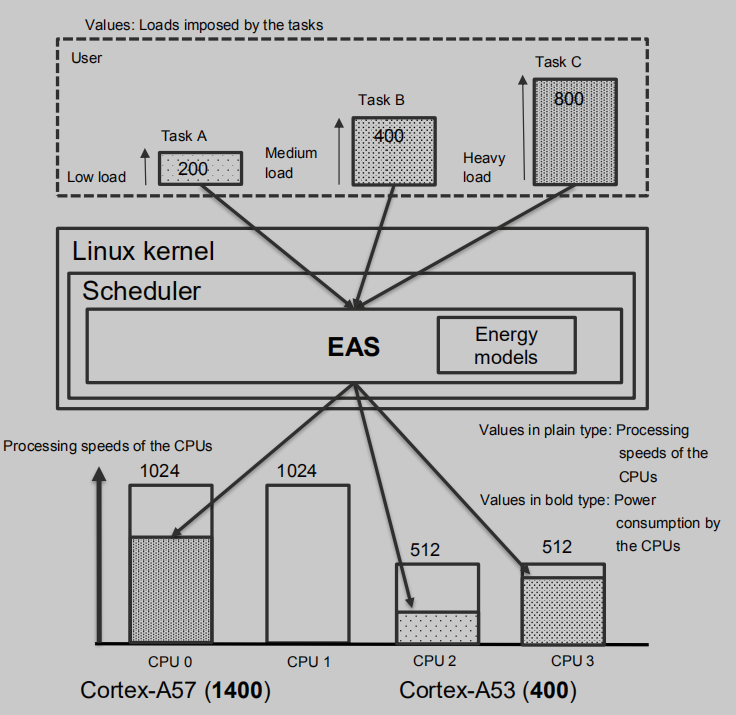

* content
{:toc}

there are many Scheduling way in mutlti-core environment, such as CFS, EAS, CAS, Processors Affinity. 



## 1. CFS

CFS mean the completely fail scheduler, and it’s the standard scheduler of Linux. The CFS assigns tasks to CPUs such that the load on each CPU is equal. Operation of the CFS is on the assumption of a symmetric multiprocessing(SMP) architecture, so its operation is not suitable in an big.LITTLE architecture like Renesas integrated the Cortex-A57 and the Cortex-A53 cores at the same time.(see in Figure1-1)

## 2. EAS 

EAS is an enhanced scheduler base on CFS and is for obtaining lower power consumption. the EAS assigns heavy-load tasks to the Cortex-A57s and low-load tasks to the Cortex-A53s, EAS applies control so that only the Cortex-A53 cores operate and places the Cotex-A57 cores in the idle state while no heavy-load tasks are running. Namely, EAS handles a kind of low power consumption mode for multi-core processing. In addition, EAS need Energy Model.(see in Figure1-2)

## 3. CAS

CAS is a function Renesas provides for use with asymmetric multiprocessing systems. It involves the consideration of SoC-dependent parameters in addition to support by the Linux kernel for asymmetric CPU capacities. CAS assigns tasks in consideration of the performance of the cores so that assigning more tasks to the Cortex-A57 cores with their greater computational capability. In CAS, the scheduler is made aware of the difference between the CPU capacities of Cotex-A57 and Cortex-A53 cores and gives higher priority to the Cotex-A57 in assigning tasks.(See in Figure 1-3)

## 4. Processor Affinity

processor affinity binds tasks to specified CPUs, it’s a standard Linux feature, so available for use with the standard board support package(BSP) from Renesas.(see Figure1-4)

## 5. How to Choice

the processor affinity is the Approaches that most suitable to ours. CFS is on the assumption of a symmetric multiprocessing(SMP) architecture, so its operation is not suitable in an environment where the Corex-A57 and Cotex-A53 cores are operating at the same time; EAS need continuous maintenance, such as continuously obtaining the latest code under development. In addition, EAS is for obtaining lower power consumption and not good at performance; CAS is just supported by Renesas, while can’t use in other hardware platform.

All in all, processor affinity is most suitable to ours. First it’s a Linux feature can be in common used on any hardware platform. Second, it’s custom for user meaning we can be able to design and control the assignment of tasks from the viewpoint of the system as a whole.

There are three methods of realizing processor affinity under Linux. Cgroup, the Cgroup is a Linux standard feature, where processes are classified into groups for control of the assignment of resources such as CPUs and memory. Cgroup can be handled through sysfs; Taskset, the taskset command can be used to realize processor affinity by specifying process IDs(PIDs) and the CPUs to run the processes from the command line. With affinity through the taskset command, CPUs must be assigned per process; Sched_setaffinity, calling the sched_setaffinity function in a program enables the execution of a process on a specified CPU. With affinity through the sched_setaffinity function, CPUs must be assigned per process.

